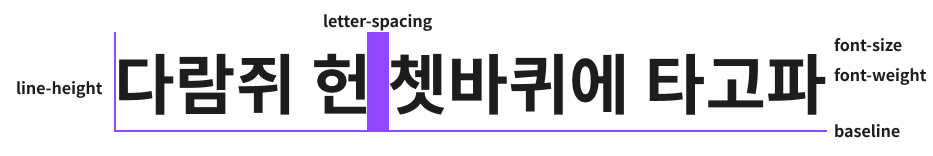

# 타이포그래피



```css
.typography {
  font-family: sans-serif;
  font-size: 16px;
  line-hieght: 32px;
  letter-spacing: -0.1em;
  font-weight: 700;
  color: #1d1d1d;
}
```

## 텍스트 레이아웃

### text-align

```css
.typography {
  /* center, right, left... */
  text-align: center;
}
```

### line-clump

몇 줄 이상 이후엔 `...`으로 표시되길 희망한다면 사용합니다.

```css
.typography {
  display: -webkit-box;
  /* 희망하는 줄을 작성해 주세요 */
  -webkit-line-clamp: 2;
  -webkit-box-orient: vertical;
  overflow: hidden;
}
```

### truncate

한줄로 표시하되 요소크기 이상부터 `...`으로 표시되길 희망한다면 사용합니다.

```css
.typography {
  overflow: hidden;
  text-overflow: ellipsis;
  white-space: nowrap;
}
```
