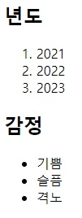

# 리스트

### Order List & Unorder List

웹 페이지에서 리스트를 작성할 때 순서 표현이 필요하다면 `ol` 을 반대는 `ul` 태그를 사용합니다.

## 순서가 있는 리스트

```html
<ol>
  <li>리스트 가</li>
  <li>리스트 나</li>
  <li>리스트 다</li>
</ol>
```

## 순서가 없는 리스트

```html
<ul>
  <li>사과</li>
  <li>바나나</li>
  <li>귤</li>
</ul>
```

:::warning 주의
ul 과 ol 요소의 자식태그로는 li만 올 수 있습니다.
:::

### 예제

**출력 결과**



:::details 복사용 텍스트
년도
2021 2022 2023

감점
기쁨 슬픔 격노
:::
