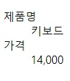

# 설명 리스트

ul, ol과 같은 리스트이지만 약간의 차이점이 있습니다. 주로 용어사전 구현, 메타데이터`키-값 쌍 목록`을 표시할 때 사용합니다.

```html
<dl>
  <dt>이름</dt>
  <dd>
    홍길동
  </dd>
  <dt>나이</dt>
  <dd>
    25
  </dd>
</dl>
```

## 리스트 경우의 수

- 하나의 용어와 하나의 정의
- 여러 개의 용어와 하나의 정의
- 하나의 용어와 여러 개의 정의
- 여러 개의 용어와 여러 개의 정의

> 관련예제는 [MDN](https://developer.mozilla.org/ko/docs/Web/HTML/Element/dl)에서 확인 할 수 있습니다.

:::warning 주의
dl 요소 자식태그로는 dd, dt, div만 올 수 있습니다.
:::

### 예제

**출력 결과**



:::details 복사용 텍스트
제품명 키보드

가격 14,000
:::
