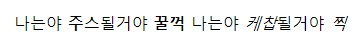

# 강조

## 시각적 vs 문서적

| 스타일 | 시각적 | 시각적 + 문서적 |
| ------ | :----: | :-------------: |
| 볼드   |   b    |     strong      |
| 이탤릭 |   i    |       em        |

## 볼드 스타일

```html
<b>시각적 = 두꺼움</b>

<strong>시각적 + 문서적 = 두꺼움 + 중요</strong>
```

## 이탤릭 스타일

```html
<i>시각적인 = 꺽임</i>

<em>시각적 + 문서적 = 꺽임 + 중요</em>
```

### 예제

주스 와 케찹은 시각적 + 문서적 강조를 꿀꺽 과 찍은 시각적 강조표현으로 작성 해 주세요.

**출력 결과**



:::details 복사용 텍스트
나는야 주스될거야 꿀꺽 나는야 케찹될거야 찍
:::
