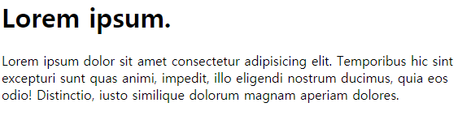

# 제목과 문단

## 표제 - Heading

신문의 헤드라인 처럼 웹 페이지의 제목을 중요성에 나눠 1~6까지 사용합니다.

```html
<h1>첫번째 제목</h1>
<h2>두번째 제목</h2>
<h3>세번째 제목</h3>
<h4>네번째 제목</h4>
<h5>다섯번째 제목</h5>
<h6>여섯번째 제목</h6>
```

### 제목 순위

> 중요 > 그 다음으로 중요

h1 > h2 > h3 > h4 > h5 > h6

## 단락 - paragraph

웹 페이지에서 단락을 사용할 때, p라는 요소(태그)를 활용해서 작성합니다.

```html
<p>
  Lorem ipsum dolor sit amet consectetur adipisicing elit. Temporibus hic sint
  excepturi sunt quas animi, impedit, illo eligendi nostrum ducimus, quia eos
  odio! Distinctio, iusto similique dolorum magnam aperiam dolores.
</p>
```

### 예제

**출력 결과**



:::details 복사용 텍스트
Lorem ipsum.

Lorem ipsum dolor sit amet consectetur adipisicing elit. Temporibus hic
sint excepturi sunt quas animi, impedit, illo eligendi nostrum ducimus,
quia eos odio! Distinctio, iusto similique dolorum magnam aperiam dolores.
:::
