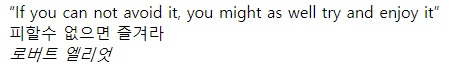

# 인용구

발췌 한 글을 옮겨 적을때 사용합니다.

```html
<blockquote>
  무릇 죽기를 각오하면 살고 살려고 하면 죽을 것이다.
  <cite>충무공 이순신</cite>
</blockquote>

<!-- Type2 -->
<blockquote cite="https://ko.wikipedia.org/">
  <q>
    로미오와 줄리엣(이탈리아어: Romeo and Juliet)은 윌리엄 셰익스피어의 초기
    희곡이다.
  </q>
  <p>
    서로 원수인 가문에서 태어난 로미오와 줄리엣이 사랑을 하게 되고 그들의
    비극적인 죽음이 가문을 화해하게 만드는 이야기이다. 아름다운 대사와 극적
    효과로 많은 칭송을 받는 셰익스피어의 대표작 가운데 하나이다. 셰익스피어
    당대에서부터 햄릿과 함께 가장 많이 공연되었으며 지금도 여전히 공연되고 있다.
    두 주인공은 젊은 연인의 전형으로 자리잡았다.
  </p>
  <cite>위키백과</cite>
</blockquote>
```

### blockquote 속성

- cite: 인용문의 출처 문서나 메시지를 가리키는 URL. 인용문의 맥락 혹은 출처 정보를 가리킬 용도입니다.

### 예제

**출력 결과**



:::details 복사용 텍스트
If you can not avoid it, you might as well try and enjoy it
피할수 없으면 즐겨라

로버트 엘리엇
:::
